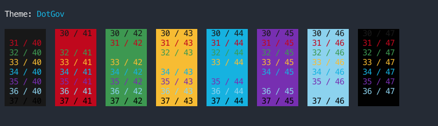
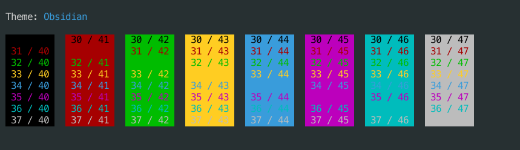
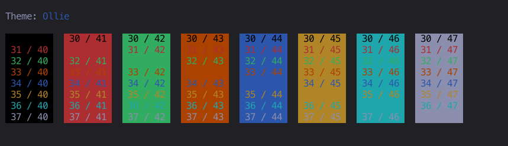
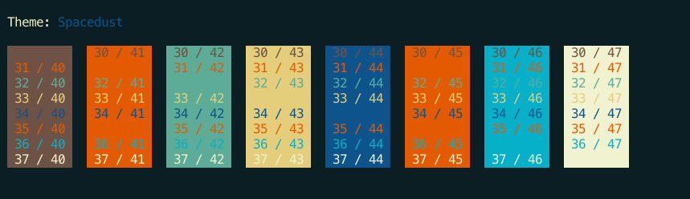
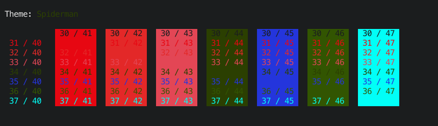

# Duckterm Themes

## Instructions

First of all, install all of the themes to your duckterm config directory using:

```bash
cd ~/.config/duckterm
git clone https://github.com/liamg/duckterm-themes.git
```

Then select the theme you want to use and create a symlink:

```bash
# backup an existing theme if you have one
mv ~/.config/duckterm/theme.yaml ~/.config/duckterm/theme.yaml.backup

# set the desired theme
ln -sf ~/.config/duckterm/duckterm-themes/themes/3024_Night.yaml ~/.config/duckterm/theme.yaml
```

To change themes in future, just overwrite the symlink, like this:

```bash
ln -sf ~/.config/duckterm/duckterm-themes/themes/3024_Night.yaml ~/.config/duckterm/theme.yaml
```

## Themes

<!--screenshots-->
### 3024_Day


### 3024_Night


### AdventureTime


### Afterglow


### AlienBlood


### Alucard


### Argonaut


### Arthur


### AtelierSulphurpool


### AtomOneLight


### Atom


### ayu_light


### ayu_mirage


### ayu


### Batman


### Belafonte_Day


### Belafonte_Night


### BirdsOfParadise


### Blazer


### Borland


### Bright_Lights


### Broadcast


### Brogrammer


### C64


### Chalkboard


### Chalk


### Ciapre


### CLRS


### Cobalt2


### Cobalt_Neon


### CrayonPonyFish


### Dark_Pastel


### Darkside


### Desert


### DimmedMonokai


### DotGov




### Dracula


### Dumbledore


### Duotone_Dark


### Earthsong


### Elemental


### ENCOM


### Espresso_Libre


### Fideloper


### FishTank


### Flatland


### Flat


### Floraverse


### FrontEndDelight


### FunForrest


### Galaxy


### Github


### Glacier


### GoaBase


### Grape


### Hardcore


### Harper


### Highway


### Hipster_Green


### Hurtado


### Hybrid


### IC_Green_PPL


### IC_Orange_PPL


### idleToes


### IR_Black


### Jackie_Brown


### Japanesque


### Jellybeans


### JetBrains_Darcula


### Kibble


### Later_This_Evening


### Lavandula


### LiquidCarbonTransparentInverse


### LiquidCarbonTransparent


### LiquidCarbon


### MaterialDark


### Material


### Mathias


### Medallion


### Misterioso


### Molokai


### MonaLisa


### Monokai_Soda


### N0tch2k


### Neopolitan


### Neutron


### NightLion_v1


### NightLion_v2


### Nova


### Obsidian




### OceanicMaterial


### Ollie




### Parasio_Dark


### PaulMillr


### PencilDark


### PencilLight


### Piatto_Light


### Pnevma


### Red_Alert


### Renault_Style_Light


### Renault_Style


### Rippedcasts


### Royal


### Seafoam_Pastel


### SeaShells


### Seti


### Shaman


### Slate


### Smyck


### SoftServer


### Solarized_Darcula


### Solarized_Dark_Higher_Contrast


### Solarized_Dark_-_Patched


### Solarized_Dark


### Solarized_Light


### Source_Code_X


### Spacedust




### SpaceGray_Eighties_Dull


### SpaceGray_Eighties


### SpaceGray


### Spiderman




### Spring


### Square


### Sundried


### Symfonic


### Tango_Dark


### Tango_Light


### Teerb


### Thayer_Bright


### The_Hulk


### Tomorrow_Night_Blue


### Tomorrow_Night_Bright


### Tomorrow_Night_Eighties


### Tomorrow_Night


### Tomorrow


### ToyChest


### Treehouse


### Twilight


### Ubuntu


### Urple


### Vaughn


### VibrantInk


### WarmNeon


### Wez


### WildCherry


### Wombat


### Wryan


